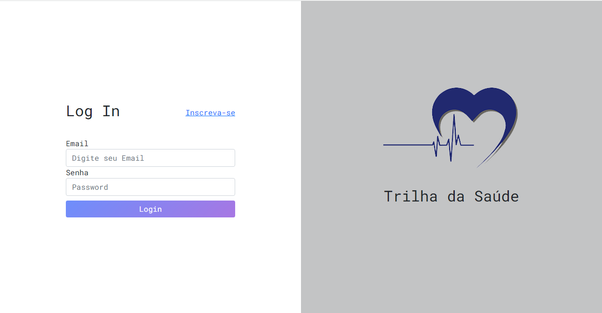
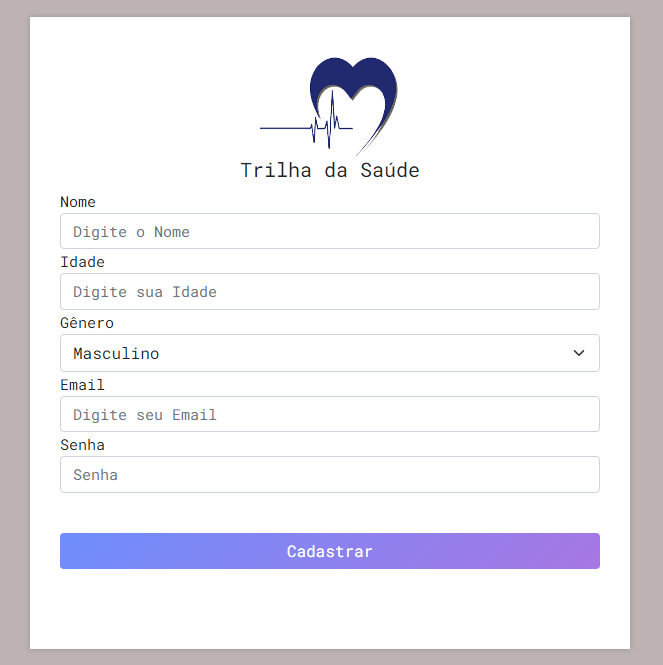
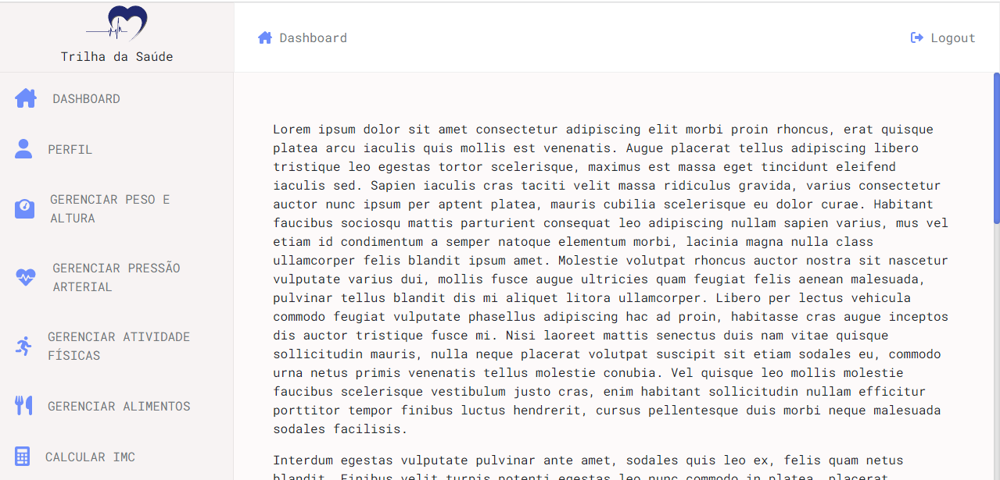

# DASHBOARDCOMHTMLCSSJS
Com continuidade do treinamento em HTML5, CSS, JS, será feita uma nova abordagem na forma de organização dos arquivos e nos padrões de projetos. O projeto terá várias páginas para compor um dashboard relacionado com a saúde do usuário, com cadastro e dados de saúde para compor o resultado final. Conforme as paginas forem sendo criadas e atualizadas serão apresentadas.

